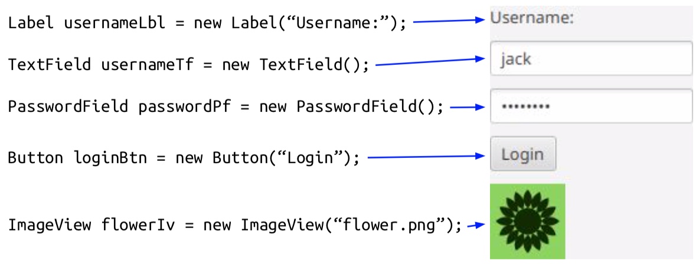

# Apps Prog Patterns Book

This is the patterns book for the subject Applications Programming at UTS.
<br/>

## Table of Contents
### [Basic Patterns](#basic-patterns)
* [Sum](#sum-pattern)
* [Output](#the-output-pattern)
* [Read](#read-pattern)
* [Read Loop](#read-loop-pattern)
* [Array Loop](#read-array-loop-pattern)
* [Count](#count-pattern)

### [Methods](#methods)
* [String Functions](#strings)
	* [String Loop](#string-loop)
	* [For-each Loop](#For-each-Loop)
	* [Looping over words in a string using split](#Looping-over-words-in-a-string-using-split)
	* [Split by one or more spaces](#Split-by-one-or-more-spaces)
	* [More String Functions](#More-String-Functions)
* [Functional Patterns](#Functional-Patterns)
	* [Read loop with read functions](#Read-loop-with-read-functions)
	* [Merged read loop](#Merged-read-loop)
	* [The “any” pattern](#the-any-pattern)
	* [The “every” pattern](#the-every-pattern)
	* [The “none” pattern](#the-none-pattern)

### [Classes](#classes)
* [toString Method for classes and objects](#toString-Method-for-classes-and-objects)
* [Format to 2 decimal places](#Format–to–2-decimal-places)
* [Getter and setter methods](#Getter–and–setter-methods)
* [Creating an object](#Creating-an-object)
* [Passing an object](#passing-an-object)
* [Using a toString Method](#Using-a-toString-Method)
* [Menu Pattern](#Menu-Pattern)

### [Lists](#lists)
* [Array Lists](#array-lists)
* [Linked Lists](#linked-lists)
* [Looping over a list](#Looping-over-a-list)
* [Copying a list](#Copying-a-list)
* [Lookup Pattern](#Lookup-Pattern)
* [Match Function](#match-function)

### [System Design](#System-design)

### [GUIs](#guis)
* [JavaFX Concepts](#JavaFX-Concepts)
	* [Nested Branches](#Nested-Branches)
	* [Packages to Import](#Packages-to-Import)
	* [Leaf Nodes](#Leaf-Nodes)
	* [Branch Nodes VBox](#Branch-Nodes-VBox)
	* [Branch Nodes HBox](#Branch-Nodes-HBox)
	* [Branch Nodes Alignment](#Branch-Nodes-Alignment)
	* [Branch Nodes GridPane](#Branch-Nodes-GridPane)
	* [Application Classs](#Application-Class)
	* [Sample Code](#Sample-Code)
* [Patterns and Syntax](#Patterns-and-Syntax)
	* [The Observer Pattern](#The-Observer-Pattern)
* [Event driven Programming](#Event-driven-Programming)


### [Model View Controller](#Model-View-Controller)
* FXML
	* Leaf Nodes
	* VBox
	* HBox
	* GridPane
		* GridPane Atributes
	* Nested branches
	* Label vs Text
	* CSS
		* Style classes
	* Loading a scene graph from an FXML file
* MVC 
	* Overview
	* Model
	* View + Controller


### GUI Lists
* e


***


## Basic Patterns
#### Sum pattern
**Goal:** Find the sum of a collection of items.

```Java
<type> sum = 0;
 <for each item>
 {
     sum += <item>;
 }
```
* Words enclosed between ```<angled brackets>``` are holes that need to be filled.
* ```<type>```  is typically double or int
* ```<for each item>``` is any loop
over a collection of items
* ```<item>``` refers to the next item in
the loop.
* x += y adds the amount y onto x

***


#### The output pattern
Goal: Show a value to the user.

* **Pattern:** ```System.out.println(“<label>” + <value>);```
* **e.g. show an age:** ``` System.out.println(“age is “ + age);```
* **e.g. show a name:** ```System.out.println(“name is “ + name);```
 
***


#### Read Pattern

Goal: Read a value from the user.


* **Pattern:** 

```Java
System.out.print(“<prompt>”);
<type> <variable> = <read operation>;
```
*or*

```Java
System.out.print(“<prompt>”); 
<variable> = <read operation>;
```
* **e.g. read an age:** 

```Java
System.out.print(“Age: “); int age = In.nextInt();
```

***

#### Read Loop Pattern

**Goal:** Read values until the user enters an “end of input” value.

```Java
<read pattern>
while (<value> != <end value>) {
   <use the value>
   <read pattern>
}
```
**Observations:** 

* \<read pattern\> appears twice
* always test for the “end of input”
value immediately after a \<read pattern>.

***

#### Array Loop Pattern

**Goal:** Loop over items in an array.

```Java
for (int i = 0; i < <array>.length; i++)
{
   <use the item array[i]>
}
```

***

#### Count Pattern

**Goal** (without guard): Count the number of items in a collection. 

```Java
int count = 0;
<for each item>
	count++;
```
**Goal** (with guard): Count the number of items that satisfy a condition.
 
```Java
int count = 0;
<for each item>
	if (<guard>)
		count++;
```

***


## Methods
### Strings
#### String Loop
**Goal:** Loop over the characters in a string.

```Java
for (int i = 0; i < <str>.length(); i++) {
   <use character str.charAt(i)>
}
```
**Example:** Count the number of l’s in the word “hello”

```Java
String s = “hello”;
int count = 0;
for (int i = 0; i < s.length(); i++) {
    if (s.charAt(i) == ‘l’)
         count++;
}
System.out.println(“Number of l’s = “ + count);
```

***

#### For each Loop
**Goal:** Loop over items in an array.

Create an array of values

```String[] array = { “car”, “truck”, “bus”, “van” };```

These two code fragments do the same thing: 

**Array Loop**

```Java
for (int i = 0; i < array.length; i++)
System.out.println(array[i]);
```
**For-Each Loop**

```Java
for (String word : array) 
System.out.println(word);
```
<br>
**Read:** For each word in array, print that word.


***

#### Looping over words in a string using split
**Program**

```Java
String sentence = “Eat your vegetables”;
for (String word : sentence.split(“ “))
   System.out.println(“Next word = “ + word);
```

**Console Output**

```
Next word = Eat
Next word = your
Next word = vegetables
```

***

#### Split by one or more spaces
* If you have a string with extra spaces between words:

```Java
String sentence = “Eat your vegetables”;
```

* Use the regular expression “ +” as the separator

```Java
for (String word : sentence.split(“ +“))
   System.out.println(“Next word = “ + word);
```

***

#### More String Functions

Function  | What is does
------------- | -------------
```boolean contains(String s)```  | does this string contain s?
```int indexOf(String s)```  | returns the position where s is found
```boolean startsWith(String s)```  | does this string start with s?
```boolean endsWith(String s)```  | does this string end with s?
```boolean equals(String s)```  | does this string equal s?
```String substring(start, end) ```  | returns a substring from start to end
```String toUpperCase()``` / ```String toLowerCase()```  | returns the string in upper/lower case
```String trim()```  | returns the string without leading/trailing spaces.


***

### Functional Patterns

#### Read loop with read functions

```Java
int age = readAge(); while (age != -1) {
<use age>
age = readAge(); }
int readAge() {
    System.out.print(“Age: “);
    return In.nextInt();
}

```

**Problem:** There is still repeated code: age = readAge();


***

#### Merged read loop

```Java
int age;
while ((age = readAge()) != -1) {
<use age> }
int readAge() {
    System.out.print(“Age: “);
    return In.nextInt();
}
```
***Key:*** call readAge() inside the while condition


##### Whenever you need a read loop, always use the merged read loop.
**Example:** reading characters:

```Java
char c;
while ((c = readChar()) != ‘.’) { <use c>
}
```

* **Example:** reading strings:

```Java
String s;
while (!(s = readString()).equals(“end”)) { <use s>
}
```

***

#### The any pattern
**Goal:** Determine if any item in a collection passes <test>

```Java
<for each item>
    if (<item passes test>)
         return true;
return false;
```

**Example:** Test if any number in an array is negative:

```
boolean anyNegative(int[] array) {
    for (int item : array)
         if (item < 0)
             return true;
    return false;
```

***

#### The every pattern
**Goal:** Determine if all items in a collection pass <test>

```Java
<for each item>
    if (! <item passes test>)
         return false;
return true;
```


***


#### The none pattern
**Goal:** Determine if no items in a collection pass <test>

```Java
<for each item>
    if (<item passes test>)
         return false;
return true;
```


***

## Classes

#### toString Method for classes and objects
Returns a string representation of the object. This is a standard method of all classes and we override the default behaviour.
 

```Java
public class Account {
   ...
   	@Override
   	public String toString() {
       return “The account has $” + balance;
 	} 
 }
```

***

####  Format to 2 decimal places
**Goal:** Show to two decimal places. 

```Java
@Override
public String toString() {
	return “The account has $” + formatted(balance);
}
private String formatted(double value) {
	DecimalFormat f = new DecimalFormat(“###,##0.00”);
   	Return f.format(value);
}
```

***

#### Getter and setter methods
- A getter returns a field The name is get<Field>
- A setter sets a field The name is set<Field>
  

```Java
public class Account {
   private String name;
   ...
   public String getName() {
       return name;
   }
   public void setName(String name) {
        this.name = name;
   }
}
```

***

#### Creating an object
- Creating an object using a constructor:
```Java
Account janesAccount = new Account(“Jane Knowles”, “Savings”, 25283.21) ;
```

***


- 'new' returns the memory address of the new object. The memory address is also known as: “reference” / “pointer”.
- The variable janesAccount stores a pointer to the object, NOT the object itself.
 
***


#### Passing an object
- Passing an object actually passes the memory address.

	```Java
	Account janesAccount = new Account(“Jane Knowles”, “Savings”, 25283.21); 
	use(janesAccount)
	
	private void use(Account account) { 
		... use account here ...
	}
	```

***


#### Using a toString Method
- Using another object’s toString method
	- Explicitly: ```System.out.println(janesAccount.toString());```
	- Implicitly: ```System.out.println(janesAccount);```
- Using this object’s toString method
	- Explicitly without this: ```System.out.println(toString());```
	- Explicitly with this: ```System.out.println(this.toString());```
	- Implicitly with this: ```System.out.println(this);```

***

#### Menu Pattern
- Read choice until exit char choice;

	```while ((choice = readChoice()) != ‘x’)```

- Execute an action 

	```Java
	switch (choice) {
	         case ‘d’: deposit(); break;
	         case ‘w’: withdraw(); break;
	         case ‘s’: show(); break;
	```

- One procedure for each action 

	```private void deposit()```

- Exit is not a switch case.
- The end-of-input flag ‘x’ ends the loop.
 
***


## Lists 
### Array Lists
 
 

#### Should I use an array list?
- Array lists provide instant access to any element. They are FAST.
- Adding elements to the end of an array list is reasonably fast.
- Inserting elements near the beginning of a list is slow.

Use an array list if you need random access to elements.
Don’t use an array list if you often need to insert elements near the beginning.

### Linked Lists
 

#### Should I use a linked list?
- Linked lists provide SLOW access to random elements.
- Adding elements to the beginning or end is FAST.
- Linked lists require more memory to store the “links”.

Use a linked list if you add and remove elements often.
Don’t use a linked list if you need fast random access to any element. 
Don’t use a linked list if you have a large data set and limited memory.

#### Type parameters vs Method parameters 
- Method parameters go after a method and use round brackets: 
	- ```System.out.println(“zoo”);```
	- ```repeat(5, “* “);```
- Type parameters go after a type and use angled brackets:
	- ``` LinkedList<Customer> customers; ```
	- ```ArrayList<Card> cards; ```
	- 	```TreeSet<String> symbols; ```
- Type parameters must be classes. For primitives, use class wrappers: 
	- ```LinkedList<Integer> ages;```
	- ```ArrayList<Double> rainfall;```
 
#### LinkedList\<X\> and ArrayList\<X\> methods


Method  | Description
------------- | -------------
```add(X element)``` | Add an element of type X to the end
```add(int i, X element)``` | Add an element of type X at position i
```remove(X element)``` | Remove this element
```remove(int i)``` | Remove the element at position i
```set(int i, X element)``` | Replace the element at position i
``X get(int i)``` | Return the element at position i
``int size()``` | Return the size of the list
``clear()``` | Remove all elements
For more, see: [https://docs.oracle.com/javase/7/docs/api/java/lang/List.html](https://docs.oracle.com/javase/7/docs/api/java/lang/List.html)

***

#### Looping over a list
Use a for-each loop.

```Java
LinkedList<String> words = new LinkedList<String>();
words.add(“one”);
words.add(“two”);
words.add(“three”);
for (String word : words)
   System.out.println(word);
 
```
***


#### Copying a list
Use a for-each loop.

```Java
LinkedList<String> original = new LinkedList<String>();
// -- add elements to original --

LinkedList<String> copy = new LinkedList<String>();
for (String word : original)
   copy.add(word);
```
Use addAll.

```Java
LinkedList<String> original = new LinkedList<String>();

// -- add elements to original --
LinkedList<String> copy = new LinkedList<String>();
copy.addAll(original);
```
***


#### Lookup Pattern
**Goal:** Find and return an element in a list. Return null if not found.

```Java
<for each item in the list>
    if (<this is the item I want>)
         return <item>;
return null;
```
**Example:** Find a particular kind of account. e.g. account(“Savings”)

```Java
private Account account(String type) { 
	for (Account account : accounts)
         if (type.equals(account.getType()))
             return account;
    return null;
}
```

***


#### Match Function
##### Client
```Java
public class Customer {
  private Account account(String type) {
	for (Account account : accounts) if (account.hasType(type))
        return account;
    return null;
}
```
 
##### Supplier
```Java
public class Account {
  private String type;
  public boolean hasType(String type) {
    return type.equals(this.type);
  }
}
```

***


## System Design
More to Come

<br>
***


## GUIs
### JavaFX Concepts
- A node is a graphical object (e.g. a Button, TextField, Label, GridPane).
- A scene is a tree of nodes.
	 
- A stage is a place to display a scene (typically a window).
- An application has a main method. It sets up and shows the primary stage.

#### Scene Graph
 
	
- A scene is a tree of nodes.
- Each node is either a branch or a leaf.
	- A branch node can have children e.g. GridPane, HBox, VBox
	- A leaf node cannot have children e.g. Button, Label, TextField

<br>
<br>
<br>
<br>
<br>


***


#### Nested Branches


***


#### Packages to Import
```Java
//Nodes:
import javafx.scene.control.*; 
import javafx.scene.layout.*; 
import javafx.scene.text.*; 
import javafx.scene.image.*;

//Scene:
import javafx.scene.*;

//Stage:
import javafx.stage.*;

//Application:
import javafx.application.*;
```
***


#### Leaf Nodes
```XML

```

***

#### Branch Nodes VBox
- A VBox lays out its children in a vertical box.
- Create a VBox with 10 pixel spacing:
	
	```VBox box = new VBox(10);```
	
- Add the the children one by one: 

	```Hava
	box.getChildren().add(usernameLbl);
	box.getChildren().add(usernameTf);
	box.getChildren().add(passwordPf);
	```

- Or add many children at once: 

	```box.getChildren().addAll(loginBtn, flowerIv);```
	
- Or Create a VBox with children:

	```VBox box = new VBox(10, usernameLbl, usernameTf, passwordPf, loginBtn, flowerIv);```


***


#### Branch Nodes HBox

- An HBox lays out its children in a horizontal box.
- HBox box = new HBox(10);

    ```box.getChildren().addAll(usernameLbl, usernameTf, loginBtn, flowerIv);```
    
    
    
- Align with setAlignment:

	```box.setAlignment(Pos.CENTER);```
	
	
	
***

####Branch Nodes Alignment

- Import

	```java
	import javafx.geometry.*; 
	box.setAlignment(position);
	```
	
- Valid positions: 

	```java
	Pos.CENTER
	Pos.CENTER_LEFT 
	Pos.CENTER_RIGHT 
	Pos.TOP_CENTER
	Pos.BOTTOM_CENTER 
	Pos.TOP_LEFT
	Pos.TOP_RIGHT
	Pos.BOTTOM_LEFT 
	Pos.BOTTOM_RIGHT
	```


***
 
#### Branch Nodes GridPane
 
- A GridPane lays out its children in a grid of rows and columns.
- Create a GridPane:

 	```GridPane grid = new GridPane();```
 
 
- Add children to the grid:

	```Java
	grid.add(usernameLbl, 0, 0); 
	grid.add(passwordLbl, 0, 1); 
	grid.add(usernameTf, 1, 0); 
	grid.add(passwordPf, 1, 1); 
	grid.add(loginBtn, 1, 2);
	```


***

#### Application Class
- The main class extends Application.
	- It defines a main method.
	- It overrides the start method.

```Java
public class BankApplication extends Application {
   public static void main(String[] args) { launch(args); }
   @Override
   public void start(Stage stage) throws Exception {
       ... code to set up and show the stage ...
   }
}
```
***

### Sample Code

#### Setup Code - 1. Create the Leaves

```Java
public class BankApplication extends Application { 
	private Label usernameLbl;
	private Label passwordLbl;
	private TextField usernameTf;
	private PasswordField passwordPf; 
	private Button loginBtn;
	
	@Override public void start(Stage stage) throws Exception { 
		usernameLbl = new Label("Username:");
   		passwordLbl = new Label("Password:"); 
   		usernameTf = new TextField(); 
   		passwordPf = new PasswordField(); 
   		loginBtn = new Button("Login");
   		...
   	}
   	...
}
```

#### Setup Code - 2. Add the leaves to a branch

```Java
@Override public void start(Stage stage) throws Exception {
    ...
	GridPane gridPane = new GridPane(); 
	gridPane.add(usernameLbl, 0, 0); 	
	gridPane.add(passwordLbl, 0, 1); 
	gridPane.add(usernameTf, 1, 0); 
	gridPane.add(passwordPf, 1, 1); 
	gridPane.add(loginBtn, 1, 2);
	...
}
```

#### Setup code - 3. Set the scene, show the stage

```Java
@Override public void start(Stage stage) throws Exception {
    ...
	stage.setScene(new Scene(gridPane)); 
	stage.setTitle(“Login”); 
	stage.show();
}
 
```

***

### Patterns and Syntax

#### 1. The Observer Pattern
**Goal:** Observers are notified whenever a subject changes.

**Example:**

- A Button notifies you when it is clicked.
- A File notifies you when it is modified.
- A Product notifies you when it is sold.

**Solution:** The solution has two phases:

- Phase 1. Observers register with the subject.
- Phase 2. When something happens to the subject, it notifies the observers.

<br>

***Phase 1 - Registration***: Each observer registers to be notified 


```
// Observer code:
subject.addObserver(this);

// Subject code:
public void addObserver(Observer o) {
     observers.add(o);
}
```
<br>

***Phase 2 - Notification***: When something happens to the subject, notify the observers. 


```
// Observer code:
public void handle() {
     do something in response
}

// Subject code:
for (Observer o : observers)
	o.handle();
```

<br>
-


**Sample - Notify observers when a product is sold**

Observers want to be notified when a product is sold. Define an interface:

```Java
public interface ProductObserver { 
	void handleSale(double money);
}
```

The CashRegister is an observer:

```Java
public class CashRegister implements ProductObserver { private double cash;
@Override public void handleSale(double money) {
         cash += money;
    }
}
```

****Phase 1: Registration****

```Java
public class Store {
  	private Product product;
  	private CashRegister cashRegister;
  	
	public Store() {
  		product = new Product();
  		cashRegister = new CashRegister();
  		product.addObserver(cashRegister);
	}
}
```
```Java
public class Product {
  	private LinkedList<ProductObserver>
      	observers = new LinkedList<ProductObserver>();
  
  	public void addObserver(ProductObserver o) {
    	observers.add(o);
	}
  	public void removeObserver(ProductObserver o) {
    	observers.remove(o);
	} 	
}
```

****Phase 2: Notification****

```Java
public class Product {
     ...
     public void sell(int n) {
          sold += n;
          double money = n * price;
 			for (ProductObserver observer : observers)
     			observer.handleSale(money);
     }    
}
```
```Java
public class CashRegister implements ProductObserver {
     	private double cash;
     	
     	@Override public void handleSale(double money) {
          cash += money;
		} 
}
```

***


#### 2. Inner Classes
- An inner class is a class defined inside another class.
- An inner class can access all members of the outer class.
- An inner class offers better encapsulation:
	- x and foo can be hidden from the outside but shared with the inner class.
	- The inner class can also be hidden from the outside.

```Java
public class OuterClass {
  	private int x;
  	private void foo() { x++; };
  	
  	private class InnerClass {
    	public void bar() {
  			foo();
      	   System.out.println(x);
     	}
	}
}
```

***Example***

```Java
public class Store {
   	private Product product;
  	private CashRegister cashRegister;
  	public Store() {
		product = new Product();
		cashRegister = new CashRegister(); 
		product.addObserver(cashRegister); 
		product.addObserver(new SalePrinter());
	}
	
  	private class SalePrinter implements ProductObserver {
      	@Override public void handleSale(double money) {
      		System.out.println(“You paid $” + money);
      	}
	}
}
```

***

#### 3. Anonymous Inner Classes
- An interface cannot be instantiated since it has no implementation: 

	✖```new ProductObserver()``` 
	
- However, you can provide the implementation while instantiating it: 
	
	✔
	
	```Java
	new ProductObserver() {
	 	@Override public void handleSale(double money) {
	      	System.out.println(“You paid $” + money);
		} 
	}
	```
- Same as defining a class that implements the interface, then creating a new instance of that class.
**Except** the class has no name. Hence, it is “anonymous”.

***Example***

```Java
public class Store {
  	private Product product;
  	private CashRegister cashRegister;
   	public Store() {
 		product = new Product();
		cashRegister = new CashRegister(); 
		product.addObserver(cashRegister); 
		
		// Inner Class
		product.addObserver(new ProductObserver() {
    		@Override public void handleSale(double money) {
         		System.out.println(“You paid $” + money);
			} 
		});
 	} 
}
```

***

#### 4. Lambda Expressions

- Anonymous inner classes with one method are very common.

	```Java
	new ProductObserver() {
		@Override public void handleSale(double money) {
			System.out.println(“You paid $” + money);
		}
	}
	```

- This is a LOT of syntax for just one method!
- A lambda expression is a shorter way to write such a method:

    ```Java
    money -> System.out.println(“You paid $” + money)
    ```
	- 'money' is the method parameter
	- 'System.out...' is the method body


**Lambda Expressions (Java8)**

```Java
//A body with one statement has no braces or semicolon:
money -> System.out.println(“Sale: $” + money)

//Curly braces enclose a block of code. Each statement has a semicolon: 
	money -> {
    	String moneyStr = formatted(money);
      	System.out.println(”Sale: $” + moneyStr);
  	}
  	
//Multiple parameters are enclosed in parentheses: 
	(param1, param2, param3) -> body

```

**Example Code**

```Java
public class Store {
 	private Product product;
  	private CashRegister cashRegister;
  	public Store() {
		product = new Product(); 
		cashRegister = new CashRegister(); 		product.addObserver(cashRegister); 
		product.addObserver(
        	money -> System.out.println(“You paid $” + money)
		);
 	} 
}
```

***

#### Which one should I use?
- Use a lambda expression if the class has one method and is used once.
- Use an anonymous inner class if the class has multiple fields/methods.
- Use an inner class if you also need to create more than one instance.
- Use a normal class if you also need to access it from other classes (or if you anticipate needing to)

***

<br>

### Event driven Programming
- An “event” is something that “happens” in a GUI application.
	- A button is clicked
	- The mouse is dragged
	- A menu item is selected
- GUI programs are entirely driven by events using the observer pattern.
	- Notify me when a button is clicked
	- Notify me when the mouse is dragged
	- Notify me when this menu item is selected
- The observers respond to events to achieve the program’s goals.

#### Handling a button click
Define an observer for each button.
- When a button is clicked, that button notifies your observer.


#### Registering an observer
- Package:

	```import javafx.event.*;```
	
- Observer interface:

	```Java
	public interface EventHandler< X> { 
		void handle(X event);
	}
	```

- x is the event type eg.:
	- ```ActionEvent``` - when a button is clicked or a menu item is selected
	- ```KeyEvent``` - when a key is pressed, released or typed 
- Reistering and Observer:

	```Java
	loginBtn.setOnAction(observer); 
	usernameTf.setOnKeyTyped(observer);
	```

**Registering an observer as an inner class**

```Java
public class MyApplication extends Application { 
	private TextField usernameTf;
	private PasswordField passwordTf;
	@Override public void start(Stage stage) {
		Button loginBtn = new Button(“Login”); 
		loginBtn.setOnAction(new LoginButtonHandler());
		...
	}
 
	private class LoginButtonHandler implements EventHandler<ActionEvent> { 
		@Override public void handle(ActionEvent event) {
    		if (checkPassword(usernameTf.getText(), passwordPf.getText())
      		...
		} 
	}
}
```

**Registering as an anonymous inner class**

```Java
public class MyApplication extends Application { 
	private TextField usernameTf;
	private PasswordField passwordTf;
	@Override public void start(Stage stage) {
		Button loginBtn = new Button(“Login”);
 		loginBtn.setOnAction(new EventHandler<ActionEvent>() { 
 			@Override public void handle(ActionEvent event) {
    			if (checkPassword(usernameTf.getText(), passwordPf.getText())
      			...
			} 
		});
		... 
	}
}
```

**Registering as a lambda expression**

```Java
public class MyApplication extends Application {
 	private TextField usernameTf;
 	private PasswordField passwordTf;
	
	@Override public void start(Stage stage) { 
		Button loginBtn = new Button(“Login”);
		loginBtn.setOnAction(event -> {
			if (checkPassword(usernameTf.getText(), passwordPf.getText())
			... 
		});
		... 
	}
}
```

#### Example - Registering an observer
**Spec**:

- Build a GUI to add 1 to a value when you click a button. 
- The GUI looks like this:


  
***The pieces:***

- Label
- TextField 
- Button
- HBox
- EventHandler<X> 
- ActionEvent
- Scene
- Stage

<br>

**The Layout**

```Java
public class IncrementorApplication extends Application {
  	public static void main(String[] args) { launch(args); }
  	private Label valueLbl;
  	private TextField valueTf;
  	private Button incrementBtn;
	@Override
   	public void start(Stage stage) {
		valueLbl = new Label(“Value”);
		valueTf = new TextField();
		incrementBtn = new Button(“+1”);
		HBox hBox = new HBox(10, valueLbl, valueTf, incBtn);
		stage.setScene(new Scene(hBox));
		stage.setTitle(“Incrementor”);
		stage.show();
    }
}
```

<br>

**TextField getter/setter pattern**

- A TextField has a getter that converts from a String.
	- Use Integer.parseInt(s) to convert the String s to an int.
	- Use Double.parseDouble(s) to convert the String s to a double.
- A TextField has a setter that converts to a String.

```Java
public class IncrementorApplication extends Application {
  	private TextField valueTf;
  	private int getValue() {
		return Integer.parseInt(valueTf.getText() ); 
	}
	private void setValue(int value) { 
		valueTf.setText(“” + value);
	}
}
```

<br>

**Set the event handler (observer)**

```Java
public class IncrementorApplication extends Application {
	private TextField valueTf;
	private int getValue() { return Integer.parseInt(valueTf.getText()); } private void 	setValue(int value) { valueTf.setText(“” + value); }
	
	@Override
   	public void start(Stage stage) {
     	...
      	incrementBtn = new Button(“+1”);
		incrementBtn.setOnAction(event -> setValue(getValue() + 1)); 
	}
}
```

- The event handler can access getValue/setValue from the outer class.

<br><br><br>
## Model View Controller 

### FXML

* Consensus: Programming languages are not good for laying out GUIs.
* Current trend: use a markup language.
* FXML is the JavaFX Markup language based on XML.
* Replace this Java code:

   ```Label usernameLbl = new Label(“Username:”);```
	
	with this FXML code:
	
   ```<Label text=”Username:”/> ```

#### Leaf Nodes

```XML
<Label text=”Username:”/>
<TextField/>
<PasswordField/>
<Button text=”Login”/>
<ImageView>
    <image><Image url=”@flower.png”/></image>
</ImageView>
```

#### VBox
```XML
<VBox spacing=”10” alignment=”center”>
	<Label text=”Username:”/>
	<TextField/>
	<PasswordField/>
	<Button text=”Login”/>
	<ImageView>
		<image><Image url=”@flower.png”/></image>
	</ImageView>
</VBox>
```

#### HBox
```XML
<HBox spacing=”10” alignment=”center”>
	<Label text=”Username:”/>
	<TextField/>
	<Button text=”Login”/>
	<ImageView>
		<image><Image url=”@flower.png”/></image>
	</ImageView>
</HBox>
```

#### GridPane
```XML
<GridPane alignment=”center” hgap=”10” vgap=”10”>
	<Label text=”Username:” GridPane.columnIndex=”0” GridPane.rowIndex=”0”/>
	<TextField GridPane.columnIndex=”1” GridPane.rowIndex=”0”/>
	<Label text=”Password:” GridPane.columnIndex=”0” GridPane.rowIndex=”1”/>
	<PasswordField GridPane.columnIndex=”1” GridPane.rowIndex=”1”/>
</GridPane>
```

##### GridPane Atributes
* Attributes for GridPane:
	* hgap sets the horizontal gap between child nodes.
	* vgap sets the vertical gap between child nodes. 
* Attributes for children of GridPane:
	* GridPane.columnIndex sets the column position of a child.
	* GridPane.rowIndex sets the row position of a child.
	* GridPane.columnSpan sets how many columns the child occupies.
 

#### Nested branches
```XML
<VBox spacing=”10”>
  <Text text=”Login”/>
  <GridPane alignment=”center” hgap=”10” vgap=”10”>
    <Label text=”Username:” GridPane.columnIndex=”0” GridPane.rowIndex=”1”/>
    <TextField GridPane.columnIndex=”1” GridPane.rowIndex=”1”/>
    <Label text=”Password:” GridPane.columnIndex=”0” GridPane.rowIndex=”2”/>
    <PasswordField GridPane.columnIndex=”1” GridPane.rowIndex=”2”/>
</GridPane>
  <HBox alignment=”center” spacing=”10”>
    <Button text=”Login”/>
    <Button text=”Cancel”/>
  </HBox>
</VBox>
```

#### Label vs Text
```XML
import javafx.scene.text.*;
```

* A <Label> is used to label a form input (e.g. a TextField, PasswordField, RadioButton, ...)
* A <Text> is to display free-standing text (e.g. a heading, informative text, error messages, ...)
* The text of a <Label> never changes.
* The text of a <Text> can be changed programmatically via its setText() method.

#### CSS
* A CSS file specifies style information. E.g. font sizes, colours, borders.
* The <stylesheets> element is placed within the root node of your scene graph
and links to the URL of your CSS file. Prefix the URL with @ if it is in the same directory as the current file.

	```XML
	<GridPane alignment=”center” hgap=”10” vgap=”10”> 
		<Text text=”Login” .../>
		...
		<stylesheets>
	  		<URL value=”@style.css”/>
	  	</stylesheets>
	</GridPane>
	```
	
	```XML
	TextField, PasswordField {
	  -fx-background-color: #ffffff;
	  -fx-border-color: black;
	} Label {
	  -fx-font-size: 12px;
	  -fx-font-weight: bold;
	  -fx-text-fill: #ffffff;
	} Button {
	  -fx-font-family: "Arial";
	  -fx-font-weight: bold;
	  -fx-background-color: #212121;
	  -fx-text-fill: #ffc107;
	  -fx-effect: dropshadow( three-pass-box, rgba(0,0,0,0.6), 5, 0.0, 0, 1 );
	}
	```

##### Style classes

```XML
// FXML
<VBox styleClass=”root”>
	<Text text=”Login” styleClass=” heading”/> 
	...
</VBox>

//Styles
.root {
-fx-background-color: #607b8d; 
-fx-padding: 50px;
}

.heading {
-fx-font-size: 32px; 
-fx-font-family: "Arial"; 
-fx-font-weight: bold; 
-fx-fill: #ffc107; 
-fx-stroke: #212121;
}
 
```

#### Loading a scene graph from an FXML file
* Use class FXMLLoader to load an FXML file.

	```Java
	import javafx.fxml.*;
	
	@Override public void start(Stage stage) throws Exception { 
		FXMLLoader loader = new
		FXMLLoader(getClass().getResource(“login.fxml”));
	    Parent root = loader.load();
	    stage.setTitle(title);
	    stage.setScene(new Scene(root));
	    stage.sizeToScene();
	    stage.show();
	}
	```


### MVC

#### Overview
The MVC pattern splits a GUI program into 3 layers

* The models are Java objects that represent the data of your application and the operations on that data.
* The views are the components that represent the graphical user interface of your application. Views “observe” data in the models.
* The controllers are the components that handle user interaction. Controllers “observe” events that occur in the views.


##### MVC Observers
MVC makes heavy use of the observer pattern:

* Each view “observes” the model.
	* When model data changes (e.g. bank balance changes), the views are notified so they can update the screen.
* Each controller “observes” the view.
	* When user interaction (e.g. a button click) happens in the view, the controllers are notified so that they can handle the event.


#### Model

* The model contains:
	* Data and related operations.
* The model does not contain:
	* User interface code:
		* No read pattern
		* No menu pattern
		* No output pattern

	```Java
	public class Account {
	    private String name;
	    private double balance;
	    public Account(String name) {
	         this.name = name;
	         balance = 0.0;
	    }
	    public void deposit(double amount) {
	         balance += amount;
	    }
	    public void withdraw(double amount) {
	         balance -= amount;
	    }
	}
	```

##### Accessing data from the view
* The GUI needs to display and sometimes update data in the model.
* Therefore, the model should provide getters and setters for data.

	```Java
	public class Account {
	    ...
	    public void getBalance() { return balance; }
	    public String getName() { return name; }
	    public void setName(String name) { this.name = name; }
	}
	```

* The balance cannot be set directly, so don’t provide a setter. Instead, use the deposit and withdraw methods.

##### JavaBeans Properties
* A pair of getter/setter methods is called a JavaBeans property: 

	```Java
	// Getter
	public String getName() { 
	 	return name; 
	}
	
	// Setter
	public void setName(String name) {
		this.name = name;
	}
	```

* A read-only JavaBeans property is a getter without a setter. e.g. 

	```Java
	public double getBalance() {
		return balance;
	}
	```

* A boolean property getter uses the prefix “is” instead of “get”: 

	```Java
	public boolean isFixedInterestRate() {
		return fixedInterestRate;
	}
	```


##### JavaFX Properties

Simple Properties | Properties | Read-only Properties
---|---|---
SimpleIntegerProperty | IntegerProperty | ReadOnlyIntegerProperty
SimpleDoubleProperty | DoubleProperty | ReadOnlyDoubleProperty
SimpleBooleanProperty | BooleanProperty | ReadOnlyBooleanProperty
SimpleStringProperty | StringProperty | ReadOnlyStringProperty
SimpleObjectProperty | ObjectProperty | ReadOnlyObjectProperty

<br>

**Pattern #1: Immutable Property**

* A property that never changes.
* Final getter. No setter.

	```Java
	public class SomeClass {
	    private final int value;
	    public SomeClass(int value) {
	         this.value = value;
	    }
	    public final int getValue() { return value; }
	}
	```
<br>

**Pattern #2: Read Write Property**

* A property that is readable, writable and observable.
* Encapsulate the value in a property object.
* Final getter and setter.
* Property method called xProperty (where x is the name of the property).

	```Java
	public class SomeClass {
	    private IntegerProperty value = new SimpleIntegerProperty();
		public SomeClass(int value) { 
			this.value.set(value) ;
		}
	
		public final int getValue() { return value.get(); }
		public final void setValue(int value) { this.value.set(value); } 
		public IntegerProperty 	valueProperty() { return value; }
	}
	```

<br>

**Pattern #3: Read Only Property**

* A property that is readable and observable. Can be written by the class.
* Encapsulate the value in a property object.
* Final getter and optional private setter.
* Property method returns a read only property.

	```Java
	public class SomeClass {
	    private IntegerProperty value = new SimpleIntegerProperty();
	    public SomeClass(int value) {
	         this.value.set(value);
	    }
	
		public final int getValue() { return value.get(); }
		private final void setValue(int value) { this.value.set(value); } 
		public ReadOnlyIntegerProperty valueProperty() { return value; }
	  }
	```

<br>

**Pattern #4: Immutable Property, Mutable State**

* A property that is a reference to an object.
* The reference doesn’t change, but the properties of the object can.
* Final getter. No setter

	```Java
	public class Customer {
	    private Account account;
	    public Customer() {
	         account = new Account(“Mr Smith”);
	    }
	    public final Account getAccount() { return account; }
	}
	```
	
<br>

* Not possible: customer.setAccount(new Account(“Dr Smith”));
* Still possible: customer.getAccount().setName(“Dr Smith”);

**Account class with JavaFX Properties**

```Java
public class Account {
   	private StringProperty name = new SimpleStringProperty();
   	private DoubleProperty balance = new SimpleDoubleProperty();
   	public Account(String name) {
     	this.name.set(name);
      	balance.set(0.0);
   	}
   	public final String getName() { return name.get(); }
  	public final void setName(String name) { this.name.set(name); }
   	public StringProperty nameProperty() { return name; }
   	public final double getBalance() { return balance.get(); }
   	public ReadOnlyDoubleProperty balanceProperty() { return balance; }
   	public void deposit(double amount) { balance.set(getBalance() + amount); }
   	public void withdraw(double amount) { balance.set(getBalance() - amount);
}
```

**Customer class with JavaFX properties**

```Java
public class Customer {
  	private final Account account;
  	
   	public Customer(String name) {
      	account = new Account(name);
  	}
  	public final Account getAccount() {
      	return account;
	} 
}
 
```

**The Payoff**

* Each property implements the observer pattern.
* The view can be notified whenever a property changes.
 

#### View + Controller

The **view** is an FXML file. It contains the scene graph.

```XML
<VBox>
    <Label text=”Name:”/>
    ...
</VBox>
```

The **controller** is a Java class. It contains the event handlers.

```Java
public class AccountController {
  	...
}
```

Each view has an associated controller class to handle user interaction.


#####  Link the view to the controller

* The root node of a scene specifies the controller:

	```XML
	<VBox xmlns:fx=”http://javafx.com/fxml” fx:controller=”AccountController”> 
		<Label text=”Name:”/>
		<TextField/>
		<Label text=”Balance:”/>
	   	<TextField/>
	   	<Label text=”Transaction amount ($):”/>
	   	<TextField text=”0.00”/>
	   	<Button text=”Deposit”/>
	   	<Button text=”Withdraw”/>
	</VBox>
	```
	
* **AccountController** is the class name for this view’s controller.

##### Node IDs

* Assign an ID to each node that the controller will need to access:

	```XML
	<VBox xmlns:fx=”http://javafx.com/fxml” fx:controller=”AccountController”> 
		<Label text=”Name:”/>
		<TextField fx:id=”nameTf”/>
		<Label text=”Balance:”/>
		<TextField fx:id=”balanceTf”/>
		<Label text=”Transaction amount ($):”/> 
		<TextField fx:id=”amountTf” text=”0.00”/> 
		<Button text=”Deposit”/>
		<Button text=”Withdraw”/>
	</VBox> 
	```

##### The Controller

* For each node with an fx:id, declare a field in the controller with the same name and annotate it with @FXML.
* Each node will be “injected” into the corresponding field.

	```Java
	import javafx.fxml.*;
	public class AccountController {
		@FXML private TextField nameTf; 
		@FXML private TextField balanceTf; 
		@FXML private TextField amountTf;
	}
	```

##### Define TextField getters/setters as needed

```Java
public class AccountController { 
	@FXML private TextField nameTf; 
	@FXML private TextField balanceTf; 
	@FXML private TextField amountTf;

  	private String getName() { return nameTf.getText(); }
  	private double getBalance() { return Double.parseDouble(balanceTf.getText());
}
  	private double getAmount() { return Double.parseDouble(amountTf.getText()); }
  	private void setAmount(double amount) { amountTf.setText(“” + amount); }
}
```

##### Set the event handlers on the buttons in FXML

```XML
<VBox xmlns:fx=”http://javafx.com/fxml” fx:controller=”AccountController”>
  	<Label text=”Name:”/>
   	<TextField fx:id=”nameTf”/>
   	<Label text=”Balance:”/>
	<TextField fx:id=”balanceTf”/>
	<Label text=”Transaction amount ($):”/>
	<TextField fx:id=”amountTf” text=”0.00”/>
	<Button text=”Deposit” onAction=”#handleDeposit”/> 
	<Button text=”Withdraw” onAction=”#handleWithdraw”/>
</VBox>
```

* **handleDeposit** and **handleWithdraw** name methods in the controller to handle action events for each button.
 
##### Define the event handlers in the controller

```Java
public class AccountController {
  	...
   	private Account account = new Account(“Mr. Smith”);

	@FXML private void handleDeposit(ActionEvent event) { 
		account.deposit(getAmount());
	setAmount(0);
	}

	@FXML private void handleWithdraw(ActionEvent event) { 
		account.withdraw(getAmount());
		setAmount(0);
	} 
}
```

##### The @FXML initialize method

Nodes annotated with @FXML are injected by FXMLLoader. BUT, only AFTER the constructor has been called.

Dereferencing a node from the constructor results in a NullPointerException.

**Solution:** Put initialisation code into the @FXML-annotated initialize method. The FXMLLoader calls this after injecting the nodes.

```Java
public class AccountController {
	@FXML private TextField nameTf; 
	@FXML private TextField balanceTf; 
	@FXML private TextField amountTf;

	public AccountController() { 
		amountTf.setText(“0.00”);
	}
	
	@FXML private void initialize() { 
		amountTf.setText(“0.00”);
	} 
}
```

##### Property bindings

Goal: Property p1 is updated whenever property p2 changes. i.e. p1 observes p2.

```p1.bind(p2);```

Goal: Properties p1 and p2 are both updated whenever the other changes. i.e. p1 observes p2 and p2 observes p1

```p1.bindBidirectional(p2);```


##### Link the view to the model

```Java
public class AccountController {
   	...
	@FXML private void initialize(){ 
		nameTf.textProperty().bindBidirectional(account.nameProperty()); 		balanceTf.textProperty().bind(account.balanceProperty());
	} 
}
```

* Bidirectional bind:
	* When the account name changes, nameTf is updated.
	* When the user edits nameTf, the account name is updated.
* Unidirectional bind:
	* When the bank balance changes, balanceTf is updated.
	* The user can’t edit balanceTf.


##### Expression bindings in FXML

FXML supports unidirectional property bindings through ```${...}``` notation.

* **In Java:** 

```balanceTf.textProperty().bind(controller.getAccount().balanceProperty());```

* **In FXML:** 

```<TextField fx:id=”balanceTf” text=”${controller.account.balance}”/>```

Binding expressions in FXML understand property naming conventions:

* Given the expression foo.bar, FXML looks for the a getBar() method or isBar() method or barProperty() method inside of object foo.

FXML does not support bidirectional bindings. They must be done in Java.


##### Link the view to the model in FXML

* Bind balanceTf to the balance inside the account inside the controller:

	```XML
	<VBox xmlns:fx=”http://javafx.com/fxml” fx:controller=”AccountController”>
		...
		<Label text=”Balance:”/>
		<TextField fx:id=”balanceTf” text=”${controller.account.balance}” />
	</VBox>
	```

* Expose an account property in the controller.
	* Property Pattern #4: Immutable property with mutable state:

	```Java
	public class AccountController {
	  	private Account account = new Account(“Mr. Smith”);
	  	public final Account getAccount() { return account; }
	}
	```


##### More complex bindings in Java

* Bind a text field to a double property formatted as currency: 

	```Java
	balanceTf.textProperty().bind(account.balanceProperty().asString(“$%.2f”));
	```

* Bind a text field to a double property concatenated with a string:

	```Java
	balanceTf.textProperty().bind(account.balanceProperty().asString().concat(“ dollars”));
	```

* Bind a property to another property to another property times a number:

	```Java
	public class Account {
	  	private static final double INTEREST_RATE = 0.07;
	 	private DoubleProperty balance = new SimpleDoubleProperty();
	   	private DoubleProperty interest = new SimpleDoubleProperty();
	 	public Account() {
	     	interest.bind(balance.multiply(INTEREST_RATE));
		}
	}
	```

The JavaFX expression binding language supports:

* Dot notation for properties. e.g. controller.account.balance
* Literals: “a string”, ‘a string’, 3.45, 27, null, true, false
* Operators: +, -, *, /, !, &&, ||, .....

Examples:

* ${account.balance * 0.07} binds to the account balance times 0.07
* ${account.balance + ‘ dollars’} binds to a string “1000.0 dollars” where
1000.0 is updated whenever the account balance changes.
 
<br>

#### MVC summary
 
<br>
<br>
 
<br>
<br>
 
<br>
<br>
 


### GUI Lists

#### Packages
* A package is a collection of related classes
* Each application or library should be placed in its own package.
* To avoid two programmers using the same package name for their application, we follow a convention:
	* Companies use the reverse of their domain name.
		* e.g. For domain name mycompany.com, use the package name com.mycompany
	* Different applications made by the same company are in sub-packages.
		* e.g. com.mycompany.calculatorapp and com.mycompany.studyapp
* Complex Applications are further divided into sub-packages.
* e.g. in an MVC application, you may have 3 sub-packages:
	* ```com.mycompany.studyapp.model``` contains the domain model classes
	* ```com.mycompany.studyapp.view``` contains the views
	* ```com.mycompany.studyapp.controller``` contains the controller classess


#### Package Declarations
* Declare a class in a package with a package declaration:

	```Java
	package com.mycompany.bankapp.model ;
	
	public class Account {
	         ...
	}
	```

* On the file system, sub-packages map onto sub-directories.
	* e.g. the ```account``` class is stored in the corresponding sub-directory:

		```Java
		com/mycompany/bankapp/model/ Account.java
		```

#### Implications for FXML
* In FXML, use a fully-qualified class name to refer to a class in a package: 

	```fx:controller=”com.mycompany.bankapp.controller.AccountController”```

* In Java, use an absolute path to refer to an FXML file in a package:

	```new FXMLLoader(getClass().getResources(“/com/mycompany.bankapp/view/account.fxml”));```
 
#### ListView
 
* A ListVew<X> displays a list of items of type X.
* Items can be either: 
	* Strings
	* Objects that have a toString() function
* Create a ListView in FXML:
    
    ```<ListView fx:id=”accountsLv”/>```
    
* Create a ListView in Java:

	```ListView<Account> accountsLv = new ListView<Account>();```
  
##### ListView Selection Models
 
* ListViews support two selection models:
	* SINGLE selection (the default model)
	* MULTIPLE selection
* In both selection models:
	* Clicking an item selects that item
	* The previously selected item is also deselected
* In the multiple selection model:
	* Shift-click or control-click to select multiple items
* If your application requires multiple selection: 

	```listView.getSelectionModel().setSelectionMode(SelectionMode.MULTIPLE);```
 
##### Setting a placeholder

* A placeholder node is shown when the ListView is empty.
* In FXML: 

	```XML
	<ListView>
		<placeholder>
			<Label text=”No accounts”/>
		</placeholder>
	</ListView>
	```

* In Java:

```accountsLv.setPlaceholder(new Label(“No accounts”));```

##### Setting preferred dimensions

* In FXML:

	```<ListView prefWidth=”300” prefHeight=”200”/>```

* In Java:

	```Java
	accountsLv.setPrefWidth( 300); 
	accountsLv.setPrefHeight( 200);
	```

##### Linking a ListView to the MODEL
* **Goal:** Whenever the model changes the view is updated.

	```Java
	public class Customer {
		private LinkedList<Account> accounts = new LinkedList<Account>();
		public void addAccount(String type) {
	   		accounts.add(new Account(type));
	  	} 
	}
	```

* **Solution**: Use an Observable List

	```Java
	public class Customer {
		private ObservableList<Account> accounts = FXCollections.observableArrayList() ;
	  	
	  	public void addAccount(String type) {
	   		accounts.add(new Account(type));
		} 
	}
	```

* Observers are notified whenever the list contents changes.

##### ObservableList "is a" relationships

// include image here

##### Linking a ListView to the model

* Define the observable list as an immutable property with mutable state:

	```Java
	public class Customer {
		private ObservableList<Account> accounts = ...;
		public final ObservableList<Account> getAccounts() { 
				return accounts;
		} 
	}
	```

* Bind the “items” property of ListView to the accounts property of customer
	* In FXML: <ListView items=”${controller.customer.accounts}”/>
	* In Java: accountsLv.setItems(customer.getAccounts());
 

##### Selecting a ListView item

**Goal:** The user selects an item from a ListView then clicks a button to perform an action on the selected item.

**Solution:** Set the onAction handler for the button to perform the following two steps:

1. Get the selected item (pattern)
2. Perform an action on that item
 
##### ListView getter pattern

* A ListView has a getter that gets the currently selected item.
* It uses the getSelectedItem() method of the selection model.

	```Java
	public class CustomerController {
	  	@FXML private ListView<Account> accountsLv;
	  	private Account getSelectedAccount() {
	     	return accountsLv.getSelectionModel().getSelectedItem();
		} 
	}
	```

##### Example: View the selected account
**FXML file**

```XML
<ListView fx:id=”accountsLv”/>
<Button text=”View Account” onAction=”#handleViewAccount” />
```

**Controller**

```Java
public class CustomerController {
 	@FXML private ListView<Account> accountsLv;
  	
  	private Account getSelectedAccount() {
    	return accountsLv.getSelectionModel().getSelectedItem();
	}
   
   	@FXML private void handleViewAccount(ActionEvent event) {
      	Account account = getSelectedAccount();
      	System.out.println(“You selected: “ + account);
	}
}
```

* If accountsLv is clicked when no item is selected, getSelectedAccount() returns null.


##### JavaFX Controls

 

 

##### Getter and Setter Patterns for controls

* It is good practice to define getters and setters to wrap the contolled value. E.g.
  
	```Java  
	private String getGender() {
		if (genderTg.getSelectedToggle() != null)
			return genderTg.getSelectedToggle().getUserData().toString();
		else
			return null;
	}
	
	private boolean isAgree() {
	 	return agreeCb.isSelected();
	}
	
	private Account getAccount() {
	  	return accountsCmb.getSelectionModel().getSelectedItem();
	}
	```

### GUI Tables

#### TableView

* A TableView<X> displays a list of items of type X.
* A TableView has:
	* A row for each item
	* A column for each property of each item
* e.g. A TableView<Account> has:
	* A row for each Account
	* A column for each property of each Account


#### FXML and Java code

* Creating a TableView in FXML:

	```Java
	<TableView fx:id=”accountsTv” prefWidth=”300” prefHeight=”200”>
		<placeholder><Label text=”No accounts”/></placeholder>
		<columns>
			<TableColumn text=”Type”/>
			<TableColumn text=”Balance”/>
		</columns>
	</TableView>
	```

* Declaring the TableView in your controller: 

	```@FXML private TableView<Account> accountsTv;```
  
##### Linking the TableView to the Model

* Two ways to link the view and model
	* In FXML:
	```<TableView fx:id=”accountsTv” items=” ${controller.customer.accounts} ”>```
	
	* In Java:
	```accountsTv.setItems( getCustomer().getAccounts() );```
* You must:
	* Expose a “customer” property in the controller
	* Expose an “accounts” property in the customer model
 
##### Linking each TableColumn to a model property

* Use a PropertyValueFactory to link the column to a property value: 

	```Java
	<?import javafx.scene.control.cell.*?>
	...
	<columns>
		<TableColumn text=”Type”>
	    	<cellValueFactory><PropertyValueFactory property=”type”/></cellValueFactory>
	   	</TableColumn>
	   	<TableColumn text=”Balance”>
	     	<cellValueFactory><PropertyValueFactory property=”balance”/></cellValueFactory>
	   	</TableColumn>
	</columns>
	```     

* You must expose the following properties in the account model: 
	* type
	* balance


##### Cell Value Factories

* A cell value factory is generates the contents of a cell. Two options:
	* PropertyValueFactory is a cell value factory that just displays a property value.
	* Define your own custom cell value factory to display data how you want.
* A cell value factory is set on the column: 

	```TableColumn<Account,String> column = ...; ```
	```column.setCellValueFactory (...);```

* TableColumn<X,Y> has two type parameters:
	* X is the type of the item being displayed in the row
	* Y is the content type of the cell in this column

##### Setting a custom cell value factory

* Assign an id to the column:

	```<TableColumn fx:id=”balanceClm” text=”Balance”/>```

* In your controller:

	```Java
	@FXML private TableColumn<Account, String> balanceClm; 
	@FXML private void initialize() {
	   	balanceClm.setCellValueFactory(cellData ->
	     	cellData.getValue().balanceProperty().asString(“$%.2f”));
	}
	```

* ```TableColumn<Account,String>``` means the item for this row is an Account, and the cell contents to be displayed is a String.
 
##### Change Listeners

* A change listener is any object that implements the ChangeListener<X> interface, where <X> is the type of value being observed.
* The interface is imported:

```Java
import javafx.beans.value.*;
public interface ChangeListener<X> {
  	void changed(ObservableValue<? extends X> observable,
	   	X oldValue, X newValue);
}
```

* Register your observer with: observable.addListener(observer);
 
##### Enable button when account is selected

* Update the disable property of the button whenever the selectedItem property changes.
* FXML:

```XML
<TableView fx:id=”accountsTv” items=”${controller.customer.accounts}”/> <Button fx:id=”viewBtn” text=”View Account” disable=”true”
             onAction=”#handleViewAccount”/>
```

* Controller:

```Java
@FXML private void initialize() {
	accountsTv.getSelectionModel(). selectedItemProperty ().addListener( 
		(o, oldAcct, newAcct) -> viewBtn. setDisable(getAccount() == null));
}
```

##### Enable button when Type >= 4 characters

* Update the button’s disable property when the text property changes.
* FXML:

	```XML
	<TextField fx:id=”typeTf”/>
	<Button fx:id=”addBtn” text=”View Account” disable=”true”
	         onAction=”#handleViewAccount”/>
	```

* Controller:

	```Java
	@FXML private void initialize() {
		typeTf.textProperty().addListener((o, oldText, newText) -> 
			addBtn.setDisable(getAccount() == null));
	}
	```
 

<br><br><br><br><!--<br><br><br><br><br><br><br><br><br><br>-->