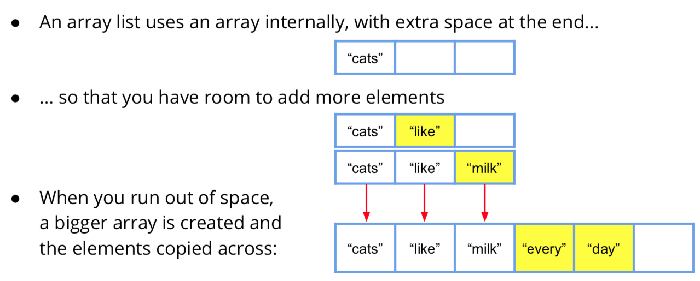

# Apps Prog Patterns Book

This is the patterns book for the subject Applications Programming at UTS.
<br/>

## Table of Contents
### [Basic Patterns](#basic-patterns)
* [Sum](#sum-pattern)
* [Output](#the-output-pattern)
* [Read](#read-pattern)
* [Read Loop](#read-loop-pattern)
* [Array Loop](#read-array-loop-pattern)
* [Count](#count-pattern)

### [Methods](#methods)
* [String Functions](#strings)
	* [String Loop](#string-loop)
	* [For-each Loop](#For-each-Loop)
	* [Looping over words in a string using split](#Looping-over-words-in-a-string-using-split)
	* [Split by one or more spaces](#Split-by-one-or-more-spaces)
	* [More String Functions](#More-String-Functions)
* [Functional Patterns](#Functional-Patterns)
	* [Read loop with read functions](#Read-loop-with-read-functions)
	* [Merged read loop](#Merged-read-loop)
	* [The “any” pattern](#the-any-pattern)
	* [The “every” pattern](#the-every-pattern)
	* [The “none” pattern](#the-none-pattern)


***


## Basic Patterns
#### Sum pattern
**Goal:** Find the sum of a collection of items.

```Java
<type> sum = 0;
 <for each item>
 {
     sum += <item>;
 }
```
* Words enclosed between ```<angled brackets>``` are holes that need to be filled.
* ```<type>```  is typically double or int
* ```<for each item>``` is any loop
over a collection of items
* ```<item>``` refers to the next item in
the loop.
* x += y adds the amount y onto x

***


#### The output pattern
Goal: Show a value to the user.

* **Pattern:** ```System.out.println(“<label>” + <value>);```
* **e.g. show an age:** ``` System.out.println(“age is “ + age);```
* **e.g. show a name:** ```System.out.println(“name is “ + name);```
 
***


#### Read Pattern

Goal: Read a value from the user.


* **Pattern:** 

```Java
System.out.print(“<prompt>”);
<type> <variable> = <read operation>;
```
*or*

```Java
System.out.print(“<prompt>”); 
<variable> = <read operation>;
```
* **e.g. read an age:** 

```Java
System.out.print(“Age: “); int age = In.nextInt();
```

***

#### Read Loop Pattern

**Goal:** Read values until the user enters an “end of input” value.

```Java
<read pattern>
while (<value> != <end value>) {
   <use the value>
   <read pattern>
}
```
**Observations:** 

* \<read pattern\> appears twice
* always test for the “end of input”
value immediately after a \<read pattern>.

***

#### Array Loop Pattern

**Goal:** Loop over items in an array.

```Java
for (int i = 0; i < <array>.length; i++)
{
   <use the item array[i]>
}
```

***

#### Count Pattern

**Goal** (without guard): Count the number of items in a collection. 

```Java
int count = 0;
<for each item>
	count++;
```
**Goal** (with guard): Count the number of items that satisfy a condition.
 
```Java
int count = 0;
<for each item>
	if (<guard>)
		count++;
```

***


## Methods
### Strings
#### String Loop
**Goal:** Loop over the characters in a string.

```Java
for (int i = 0; i < <str>.length(); i++) {
   <use character str.charAt(i)>
}
```
**Example:** Count the number of l’s in the word “hello”

```Java
String s = “hello”;
int count = 0;
for (int i = 0; i < s.length(); i++) {
    if (s.charAt(i) == ‘l’)
         count++;
}
System.out.println(“Number of l’s = “ + count);
```

***

#### For each Loop
**Goal:** Loop over items in an array.

Create an array of values

```String[] array = { “car”, “truck”, “bus”, “van” };```

These two code fragments do the same thing: 

**Array Loop**

```Java
for (int i = 0; i < array.length; i++)
System.out.println(array[i]);
```
**For-Each Loop**

```Java
for (String word : array) 
System.out.println(word);
```
<br>
**Read:** For each word in array, print that word.


***

#### Looping over words in a string using split
**Program**

```Java
String sentence = “Eat your vegetables”;
for (String word : sentence.split(“ “))
   System.out.println(“Next word = “ + word);
```

**Console Output**

```
Next word = Eat
Next word = your
Next word = vegetables
```

***

#### Split by one or more spaces
* If you have a string with extra spaces between words:

```Java
String sentence = “Eat your vegetables”;
```

* Use the regular expression “ +” as the separator

```Java
for (String word : sentence.split(“ +“))
   System.out.println(“Next word = “ + word);
```

***

#### More String Functions

Function  | What is does
------------- | -------------
```boolean contains(String s)```  | does this string contain s?
```int indexOf(String s)```  | returns the position where s is found
```boolean startsWith(String s)```  | does this string start with s?
```boolean endsWith(String s)```  | does this string end with s?
```boolean equals(String s)```  | does this string equal s?
```String substring(start, end) ```  | returns a substring from start to end
```String toUpperCase()``` / ```String toLowerCase()```  | returns the string in upper/lower case
```String trim()```  | returns the string without leading/trailing spaces.


***

### Functional Patterns

#### Read loop with read functions

```Java
int age = readAge(); while (age != -1) {
<use age>
age = readAge(); }
int readAge() {
    System.out.print(“Age: “);
    return In.nextInt();
}

```

**Problem:** There is still repeated code: age = readAge();


***

#### Merged read loop

```Java
int age;
while ((age = readAge()) != -1) {
<use age> }
int readAge() {
    System.out.print(“Age: “);
    return In.nextInt();
}
```
***Key:*** call readAge() inside the while condition


##### Whenever you need a read loop, always use the merged read loop.
**Example:** reading characters:

```Java
char c;
while ((c = readChar()) != ‘.’) { <use c>
}
```

* **Example:** reading strings:

```Java
String s;
while (!(s = readString()).equals(“end”)) { <use s>
}
```

***

#### The any pattern
**Goal:** Determine if any item in a collection passes <test>

```Java
<for each item>
    if (<item passes test>)
         return true;
return false;
```

**Example:** Test if any number in an array is negative:

```
boolean anyNegative(int[] array) {
    for (int item : array)
         if (item < 0)
             return true;
    return false;
```

***

#### The every pattern
**Goal:** Determine if all items in a collection pass <test>

```Java
<for each item>
    if (! <item passes test>)
         return false;
return true;
```


***


#### The none pattern
**Goal:** Determine if no items in a collection pass <test>

```Java
<for each item>
    if (<item passes test>)
         return false;
return true;
```


***

## Classes

#### toString Method for classes/object
Returns a string representation of the object. This is a standard method of all classes and we override the default behaviour.
 

```Java
public class Account {
   ...
   	@Override
   	public String toString() {
       return “The account has $” + balance;
 	} 
 }
```

***

####  Format to 2 decimal places - pattern
**Goal:** Show to two decimal places. 

```Java
@Override
public String toString() {
	return “The account has $” + formatted(balance);
}
private String formatted(double value) {
	DecimalFormat f = new DecimalFormat(“###,##0.00”);
   	Return f.format(value);
}
```

***

#### Getter and setter methods
- A getter returns a field The name is get<Field>
- A setter sets a field The name is set<Field>
  

```Java
public class Account {
   private String name;
   ...
   public String getName() {
       return name;
   }
   public void setName(String name) {
        this.name = name;
   }
}
```

***

#### Creating an object
- Creating an object using a constructor:
```Java
Account janesAccount = new Account(“Jane Knowles”, “Savings”, 25283.21) ;
```

***


- 'new' returns the memory address of the new object. The memory address is also known as: “reference” / “pointer”.
- The variable janesAccount stores a pointer to the object, NOT the object itself.
 
***


#### Passing an object
- Passing an object actually passes the memory address.

	```Java
	Account janesAccount = new Account(“Jane Knowles”, “Savings”, 25283.21); 
	use(janesAccount)
	
	private void use(Account account) { 
		... use account here ...
	}
	```

***


#### Using a toString Method
- Using another object’s toString method
	- Explicitly: ```System.out.println(janesAccount.toString());```
	- Implicitly: ```System.out.println(janesAccount);```
- Using this object’s toString method
	- Explicitly without this: ```System.out.println(toString());```
	- Explicitly with this: ```System.out.println(this.toString());```
	- Implicitly with this: ```System.out.println(this);```

***

#### Menu Pattern
- Read choice until exit char choice;

	```while ((choice = readChoice()) != ‘x’)```

- Execute an action 

	```Java
	switch (choice) {
	         case ‘d’: deposit(); break;
	         case ‘w’: withdraw(); break;
	         case ‘s’: show(); break;
	```

- One procedure for each action 

	```private void deposit()```

- Exit is not a switch case.
- The end-of-input flag ‘x’ ends the loop.
 
***


## Lists 
### Array Lists
 
 

#### Should I use an array list?
- Array lists provide instant access to any element. They are FAST.
- Adding elements to the end of an array list is reasonably fast.
- Inserting elements near the beginning of a list is slow.

Use an array list if you need random access to elements.
Don’t use an array list if you often need to insert elements near the beginning.

### Linked Lists
 

#### Should I use a linked list?
- Linked lists provide SLOW access to random elements.
- Adding elements to the beginning or end is FAST.
- Linked lists require more memory to store the “links”.

Use a linked list if you add and remove elements often.
Don’t use a linked list if you need fast random access to any element. 
Don’t use a linked list if you have a large data set and limited memory.

#### Type parameters vs Method parameters 
- Method parameters go after a method and use round brackets: 
	- ```System.out.println(“zoo”);```
	- ```repeat(5, “* “);```
- Type parameters go after a type and use angled brackets:
	- ``` LinkedList<Customer> customers; ```
	- ```ArrayList<Card> cards; ```
	- 	```TreeSet<String> symbols; ```
- Type parameters must be classes. For primitives, use class wrappers: 
	- ```LinkedList<Integer> ages;```
	- ```ArrayList<Double> rainfall;```
 
#### LinkedList\<X\> and ArrayList\<X\> methods


Method  | Description
------------- | -------------
```add(X element)``` | Add an element of type X to the end
```add(int i, X element)``` | Add an element of type X at position i
```remove(X element)``` | Remove this element
```remove(int i)``` | Remove the element at position i
```set(int i, X element)``` | Replace the element at position i
``X get(int i)``` | Return the element at position i
``int size()``` | Return the size of the list
``clear()``` | Remove all elements
For more, see: [https://docs.oracle.com/javase/7/docs/api/java/lang/List.html](https://docs.oracle.com/javase/7/docs/api/java/lang/List.html)

***

#### Looping over a list
Use a for-each loop.

```Java
LinkedList<String> words = new LinkedList<String>();
words.add(“one”);
words.add(“two”);
words.add(“three”);
for (String word : words)
   System.out.println(word);
 
```
***


#### Copying a list
Use a for-each loop.

```Java
LinkedList<String> original = new LinkedList<String>();
// -- add elements to original --

LinkedList<String> copy = new LinkedList<String>();
for (String word : original)
   copy.add(word);
```
Use addAll.

```Java
LinkedList<String> original = new LinkedList<String>();

// -- add elements to original --
LinkedList<String> copy = new LinkedList<String>();
copy.addAll(original);
```
***


#### Lookup Pattern
**Goal:** Find and return an element in a list. Return null if not found.

```Java
<for each item in the list>
    if (<this is the item I want>)
         return <item>;
return null;
```
**Example:** Find a particular kind of account. e.g. account(“Savings”)

```Java
private Account account(String type) { 
	for (Account account : accounts)
         if (type.equals(account.getType()))
             return account;
    return null;
}
```

***


#### Match Function - Push Right
##### Client
```Java
public class Customer {
  private Account account(String type) {
	for (Account account : accounts) if (account.hasType(type))
        return account;
    return null;
}
```
 
##### Supplier
```Java
public class Account {
  private String type;
  public boolean hasType(String type) {
    return type.equals(this.type);
  }
}
```

***


## System Design
More to Come

<br>
***


## GUIs
### JavaFX Concepts
- A node is a graphical object (e.g. a Button, TextField, Label, GridPane).
- A scene is a tree of nodes.
	 
- A stage is a place to display a scene (typically a window).
- An application has a main method. It sets up and shows the primary stage.

####Scene Graph
 
	
- A scene is a tree of nodes.
- Each node is either a branch or a leaf.
	- A branch node can have children e.g. GridPane, HBox, VBox
	- A leaf node cannot have children e.g. Button, Label, TextField

<br>
<br>
<br>
<br>
<br>


***


#### Nested Branches


***


#### Packages to Import
```Java
//Nodes:
import javafx.scene.control.*; 
import javafx.scene.layout.*; 
import javafx.scene.text.*; 
import javafx.scene.image.*;

//Scene:
import javafx.scene.*;

//Stage:
import javafx.stage.*;

//Application:
import javafx.application.*;
```
***


#### Leaf Nodes


***

#### Branch Nodes - VBox
- A VBox lays out its children in a vertical box.
- Create a VBox with 10 pixel spacing:
	
	```VBox box = new VBox(10);```
	
- Add the the children one by one: 

	```Hava
	box.getChildren().add(usernameLbl);
	box.getChildren().add(usernameTf);
	box.getChildren().add(passwordPf);
	```

- Or add many children at once: 

	```box.getChildren().addAll(loginBtn, flowerIv);```
	
- Or Create a VBox with children:

	```VBox box = new VBox(10, usernameLbl, usernameTf, passwordPf, loginBtn, flowerIv);```


***


#### Branch Nodes - HBox

- An HBox lays out its children in a horizontal box.
- HBox box = new HBox(10);

    ```box.getChildren().addAll(usernameLbl, usernameTf, loginBtn, flowerIv);```
    
    
    
- Align with setAlignment:

	```box.setAlignment(Pos.CENTER);```
	
	
	
***

####Branch Nodes - Alignment

- Import

	```java
	import javafx.geometry.*; 
	box.setAlignment(position);
	```
	
- Valid positions: 

	```java
	Pos.CENTER
	Pos.CENTER_LEFT 
	Pos.CENTER_RIGHT 
	Pos.TOP_CENTER
	Pos.BOTTOM_CENTER 
	Pos.TOP_LEFT
	Pos.TOP_RIGHT
	Pos.BOTTOM_LEFT 
	Pos.BOTTOM_RIGHT
	```


***
 
#### Branch Nodes - GridPane
 
- A GridPane lays out its children in a grid of rows and columns.
- Create a GridPane:

 	```GridPane grid = new GridPane();```
 
 
- Add children to the grid:

	```Java
	grid.add(usernameLbl, 0, 0); 
	grid.add(passwordLbl, 0, 1); 
	grid.add(usernameTf, 1, 0); 
	grid.add(passwordPf, 1, 1); 
	grid.add(loginBtn, 1, 2);
	```


***

#### Application Classs
- The main class extends Application.
	- It defines a main method.
	- It overrides the start method.

```Java
public class BankApplication extends Application {
   public static void main(String[] args) { launch(args); }
   @Override
   public void start(Stage stage) throws Exception {
       ... code to set up and show the stage ...
   }
}
```
***

### Sample Code

#### Setup Code - 1. Create the Leaves

```Java
public class BankApplication extends Application { 
	private Label usernameLbl;
	private Label passwordLbl;
	private TextField usernameTf;
	private PasswordField passwordPf; 
	private Button loginBtn;
	
	@Override public void start(Stage stage) throws Exception { 
		usernameLbl = new Label("Username:");
   		passwordLbl = new Label("Password:"); 
   		usernameTf = new TextField(); 
   		passwordPf = new PasswordField(); 
   		loginBtn = new Button("Login");
   		...
   	}
   	...
}
```

#### Setup Code - 2. Add the leaves to a branch

```Java
@Override public void start(Stage stage) throws Exception {
    ...
	GridPane gridPane = new GridPane(); 
	gridPane.add(usernameLbl, 0, 0); 	
	gridPane.add(passwordLbl, 0, 1); 
	gridPane.add(usernameTf, 1, 0); 
	gridPane.add(passwordPf, 1, 1); 
	gridPane.add(loginBtn, 1, 2);
	...
}
```

#### Setup code - 3. Set the scene, show the stage

```Java
@Override public void start(Stage stage) throws Exception {
    ...
	stage.setScene(new Scene(gridPane)); 
	stage.setTitle(“Login”); 
	stage.show();
}
 
```

***

### Patterns and Syntax

#### 1. The Observer Pattern
**Goal:** Observers are notified whenever a subject changes.

**Example:**

- A Button notifies you when it is clicked.
- A File notifies you when it is modified.
- A Product notifies you when it is sold.

**Solution:** The solution has two phases:

- Phase 1. Observers register with the subject.
- Phase 2. When something happens to the subject, it notifies the observers.

<br>

***Phase 1 - Registration***: Each observer registers to be notified 


```
// Observer code:
subject.addObserver(this);

// Subject code:
public void addObserver(Observer o) {
     observers.add(o);
}
```
<br>

***Phase 2 - Notification***: When something happens to the subject, notify the observers. 


```
// Observer code:
public void handle() {
     do something in response
}

// Subject code:
for (Observer o : observers)
	o.handle();
```

<br>
-


**Sample - Notify observers when a product is sold**

Observers want to be notified when a product is sold. Define an interface:

```Java
public interface ProductObserver { 
	void handleSale(double money);
}
```

The CashRegister is an observer:

```Java
public class CashRegister implements ProductObserver { private double cash;
@Override public void handleSale(double money) {
         cash += money;
    }
}
```

****Phase 1: Registration****

```Java
public class Store {
  	private Product product;
  	private CashRegister cashRegister;
  	
	public Store() {
  		product = new Product();
  		cashRegister = new CashRegister();
  		product.addObserver(cashRegister);
	}
}
```
```Java
public class Product {
  	private LinkedList<ProductObserver>
      	observers = new LinkedList<ProductObserver>();
  
  	public void addObserver(ProductObserver o) {
    	observers.add(o);
	}
  	public void removeObserver(ProductObserver o) {
    	observers.remove(o);
	} 	
}
```

****Phase 2: Notification****

```Java
public class Product {
     ...
     public void sell(int n) {
          sold += n;
          double money = n * price;
 			for (ProductObserver observer : observers)
     			observer.handleSale(money);
     }    
}
```
```Java
public class CashRegister implements ProductObserver {
     	private double cash;
     	
     	@Override public void handleSale(double money) {
          cash += money;
		} 
}
```

***


#### 2. Inner Classes
- An inner class is a class defined inside another class.
- An inner class can access all members of the outer class.
- An inner class offers better encapsulation:
	- x and foo can be hidden from the outside but shared with the inner class.
	- The inner class can also be hidden from the outside.

```Java
public class OuterClass {
  	private int x;
  	private void foo() { x++; };
  	
  	private class InnerClass {
    	public void bar() {
  			foo();
      	   System.out.println(x);
     	}
	}
}
```

***Example***

```Java
public class Store {
   	private Product product;
  	private CashRegister cashRegister;
  	public Store() {
		product = new Product();
		cashRegister = new CashRegister(); 
		product.addObserver(cashRegister); 
		product.addObserver(new SalePrinter());
	}
	
  	private class SalePrinter implements ProductObserver {
      	@Override public void handleSale(double money) {
      		System.out.println(“You paid $” + money);
      	}
	}
}
```

***

#### 3. Anonymous Inner Classes
- An interface cannot be instantiated since it has no implementation: 

	✖```new ProductObserver()``` 
	
- However, you can provide the implementation while instantiating it: 
	
	✔
	
	```Java
	new ProductObserver() {
	 	@Override public void handleSale(double money) {
	      	System.out.println(“You paid $” + money);
		} 
	}
	```
- Same as defining a class that implements the interface, then creating a new instance of that class.
**Except** the class has no name. Hence, it is “anonymous”.

***Example***

```Java
public class Store {
  	private Product product;
  	private CashRegister cashRegister;
   	public Store() {
 		product = new Product();
		cashRegister = new CashRegister(); 
		product.addObserver(cashRegister); 
		
		// Inner Class
		product.addObserver(new ProductObserver() {
    		@Override public void handleSale(double money) {
         		System.out.println(“You paid $” + money);
			} 
		});
 	} 
}
```

***

#### 4. Lambda Expressions

- Anonymous inner classes with one method are very common.

	```Java
	new ProductObserver() {
		@Override public void handleSale(double money) {
			System.out.println(“You paid $” + money);
		}
	}
	```

- This is a LOT of syntax for just one method!
- A lambda expression is a shorter way to write such a method:

    ```Java
    money -> System.out.println(“You paid $” + money)
    ```
	- 'money' is the method parameter
	- 'System.out...' is the method body


**Lambda Expressions (Java8)**

```Java
//A body with one statement has no braces or semicolon:
money -> System.out.println(“Sale: $” + money)

//Curly braces enclose a block of code. Each statement has a semicolon: 
	money -> {
    	String moneyStr = formatted(money);
      	System.out.println(”Sale: $” + moneyStr);
  	}
  	
//Multiple parameters are enclosed in parentheses: 
	(param1, param2, param3) -> body

```

**Example Code**

```Java
public class Store {
 	private Product product;
  	private CashRegister cashRegister;
  	public Store() {
		product = new Product(); 
		cashRegister = new CashRegister(); 		product.addObserver(cashRegister); 
		product.addObserver(
        	money -> System.out.println(“You paid $” + money)
		);
 	} 
}
```

***

#### Which one should I use?
- Use a lambda expression if the class has one method and is used once.
- Use an anonymous inner class if the class has multiple fields/methods.
- Use an inner class if you also need to create more than one instance.
- Use a normal class if you also need to access it from other classes (or if you anticipate needing to)

***

<br>

### Event-driven Programming
- An “event” is something that “happens” in a GUI application.
	- A button is clicked
	- The mouse is dragged
	- A menu item is selected
- GUI programs are entirely driven by events using the observer pattern.
	- Notify me when a button is clicked
	- Notify me when the mouse is dragged
	- Notify me when this menu item is selected
- The observers respond to events to achieve the program’s goals.

#### Handling a button click
Define an observer for each button.
- When a button is clicked, that button notifies your observer.


#### Registering an observer
- Package:

	```import javafx.event.*;```
	
- Observer interface:

	```Java
	public interface EventHandler< X> { 
		void handle(X event);
	}
	```

- x is the event type eg.:
	- ```ActionEvent``` - when a button is clicked or a menu item is selected
	- ```KeyEvent``` - when a key is pressed, released or typed 
- Reistering and Observer:

	```Java
	loginBtn.setOnAction(observer); 
	usernameTf.setOnKeyTyped(observer);
	```

**Registering an observer as an inner class**

```Java
public class MyApplication extends Application { 
	private TextField usernameTf;
	private PasswordField passwordTf;
	@Override public void start(Stage stage) {
		Button loginBtn = new Button(“Login”); 
		loginBtn.setOnAction(new LoginButtonHandler());
		...
	}
 
	private class LoginButtonHandler implements EventHandler<ActionEvent> { 
		@Override public void handle(ActionEvent event) {
    		if (checkPassword(usernameTf.getText(), passwordPf.getText())
      		...
		} 
	}
}
```

**Registering as an anonymous inner class**

```Java
public class MyApplication extends Application { 
	private TextField usernameTf;
	private PasswordField passwordTf;
	@Override public void start(Stage stage) {
		Button loginBtn = new Button(“Login”);
 		loginBtn.setOnAction(new EventHandler<ActionEvent>() { 
 			@Override public void handle(ActionEvent event) {
    			if (checkPassword(usernameTf.getText(), passwordPf.getText())
      			...
			} 
		});
		... 
	}
}
```

**Registering as a lambda expression**

```Java
public class MyApplication extends Application {
 	private TextField usernameTf;
 	private PasswordField passwordTf;
	
	@Override public void start(Stage stage) { 
		Button loginBtn = new Button(“Login”);
		loginBtn.setOnAction(event -> {
			if (checkPassword(usernameTf.getText(), passwordPf.getText())
			... 
		});
		... 
	}
}
```

#### Example - Registering an observer
**Spec**:

- Build a GUI to add 1 to a value when you click a button. 
- The GUI looks like this:


  
***The pieces:***

- Label
- TextField 
- Button
- HBox
- EventHandler<X> 
- ActionEvent
- Scene
- Stage

<br>

**The Layout**

```Java
public class IncrementorApplication extends Application {
  	public static void main(String[] args) { launch(args); }
  	private Label valueLbl;
  	private TextField valueTf;
  	private Button incrementBtn;
	@Override
   	public void start(Stage stage) {
		valueLbl = new Label(“Value”);
		valueTf = new TextField();
		incrementBtn = new Button(“+1”);
		HBox hBox = new HBox(10, valueLbl, valueTf, incBtn);
		stage.setScene(new Scene(hBox));
		stage.setTitle(“Incrementor”);
		stage.show();
    }
}
```

<br>

**TextField getter/setter pattern**

- A TextField has a getter that converts from a String.
	- Use Integer.parseInt(s) to convert the String s to an int.
	- Use Double.parseDouble(s) to convert the String s to a double.
- A TextField has a setter that converts to a String.

```Java
public class IncrementorApplication extends Application {
  	private TextField valueTf;
  	private int getValue() {
		return Integer.parseInt(valueTf.getText() ); 
	}
	private void setValue(int value) { 
		valueTf.setText(“” + value);
	}
}
```

<br>

**Set the event handler (observer)**

```Java
public class IncrementorApplication extends Application {
	private TextField valueTf;
	private int getValue() { return Integer.parseInt(valueTf.getText()); } private void 	setValue(int value) { valueTf.setText(“” + value); }
	
	@Override
   	public void start(Stage stage) {
     	...
      	incrementBtn = new Button(“+1”);
		incrementBtn.setOnAction(event -> setValue(getValue() + 1)); 
	}
}
```

- The event handler can access getValue/setValue from the outer class.

<br><br><br>
## MVC - Model View Controller 


<br><br><br><br><br><br><br><br><br><br><br><br><br><br><br><br><br><br><br><br><br><br><br><br>